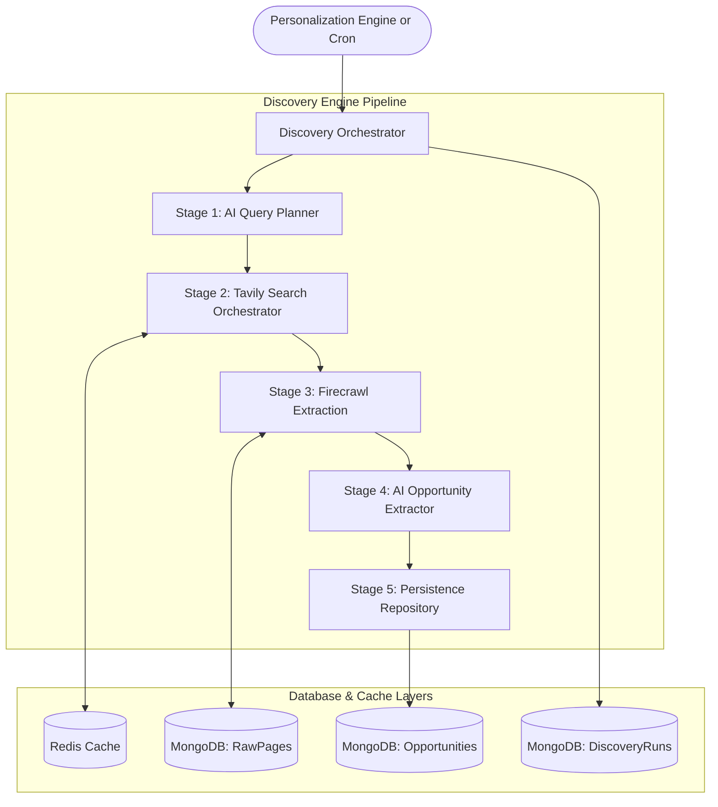
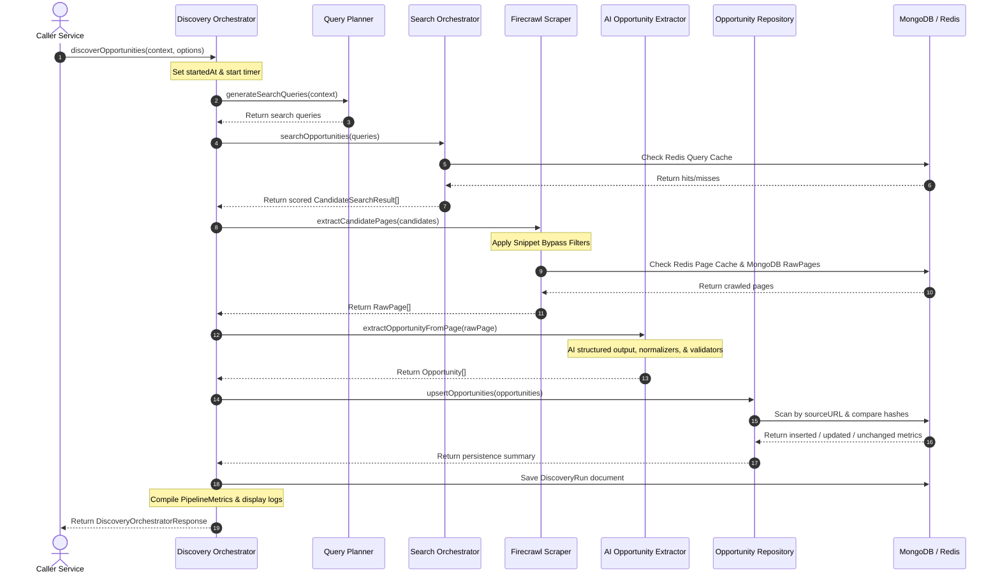

# Scout Phase 4: Discovery Engine Technical Architecture Summary

This document summarizes the technical design, system architecture, data models, and workflows implemented for the **Scout Discovery Engine (Phase 4)**.

---

## 1. Engine Architecture & Component Breakdown

The Discovery Engine is built as a modular, resilient crawling and data-structuring pipeline. It exposes a single consolidated public orchestrator service that coordinates five internal components.

### Component Overview

1. **Query Planner (Stage 1)**: Converts user targeting context (e.g. audience, country, category) into highly targeted, space-separated search keywords using structured AI generation.
2. **Search Orchestrator (Stage 2)**: Calls Tavily Search to gather candidate URLs, removes duplicates, implements score filters, and caches results in Redis (`search:{query}`) with a 6-hour TTL.
3. **Firecrawl Extraction (Stage 3)**: Fetches and cleans webpage markdown. Optimizes credit usage by skipping scraping when a search snippet already has high relevance (length > 150 & score > 12) and caching scraped pages in Redis (24-hour TTL) and MongoDB (`RawPage`).
4. **AI Opportunity Extractor (Stage 4)**: Uses structured LLM generation with fallback handling (Gemini to Groq) and Zod auto-healing to extract raw markdown into validated TS structures.
5. **Persistence Repository (Stage 5)**: Manages database transactions. Bypasses duplicate records based on `sourceURL` or `applicationUrl` and compares SHA256 hashes to log runs as inserts, updates, or unchanged.

---

## 2. Telemetry and Run Logs

A history of pipeline runs is logged to the `DiscoveryRun` collection in MongoDB for debugging, credit auditing, and analytics.

---

## 3. Data Schema Specifications

### Mongoose Models

#### 1. Opportunity Model (`Opportunity`)
Keeps track of extracted program metadata.
- **`title`**: String (Required)
- **`description`**: String (Required, full content text)
- **`summary`**: String (Required, 2-3 sentence overview)
- **`organization`**: String (Required, defaults to "Unknown Organization")
- **`opportunityType`**: String (Indexed: `JOB`, `INTERNSHIP`, `SCHOLARSHIP`, `FELLOWSHIP`, `GRANT`, `FREELANCE`, etc.)
- **`sourceURL`**: String (Unique Indexed, canonical source)
- **`applicationUrl`**: String (Unique Indexed, application link)
- **`rawPageId`**: ObjectId (Ref: `RawPage`, parent source link)
- **`hash`**: String (SHA256 hash of source markdown, used for updates check)
- **`aiMetadata`**: Object containing:
  - `provider`: String
  - `model`: String
  - `latencyMs`: Number
  - `extractionVersion`: String (Prompt tracker value)

#### 2. RawPage Model (`RawPage`)
Stores raw crawled HTML converted into markdown.
- **`url`**: String (Unique Indexed)
- **`title`**: String
- **`markdown`**: String
- **`hash`**: String (SHA256 hash of content)
- **`crawledAt`**: Date

#### 3. DiscoveryRun Model (`DiscoveryRun`)
Maintains run analytics and telemetry logs.
- **`startedAt`**: Date (Required)
- **`finishedAt`**: Date (Required)
- **`targetAudience`**: String (Required)
- **`categories`**: Array of Strings
- **`totalQueries`**: Number (Required)
- **`inserted`**: Number (Required)
- **`updated`**: Number (Required)
- **`failures`**: Number (Required)
- **`duration`**: Number (Required, in seconds)

---

## 4. Key Performance Optimizations

* **Tavily Query Cache**: Redis cache key `search:{query}` saves API lookup latency and costs. Retains queries for 6 hours.
* **Snippet Bypass Strategy**: If a Tavily result snippet is long (>150 chars) and highly relevant (relevance score > 12), the scraper uses the snippet directly as page markdown. This bypasses Firecrawl, saving up to 50% of scraping credits.
* **Firecrawl Page Cache**: Redis key `page:{url}` caches crawled markdown for 24 hours.
* **Concurrent Chunk Pool**: Crawling and AI extractions run using chunked concurrency controls (searches limit to 5, crawl tasks limit to 3) to prevent API rate-limiting or memory exhaustion.
* **Fallback Routing & Schema Healing**: Features transparent fallback routing from Gemini to Groq if rate limits are hit. Validations undergo automatic JSON repairs inside the gateway if schemas fail Zod matching.
